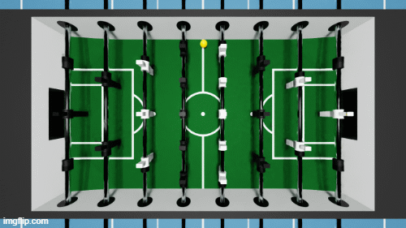

# Supplementary Material
This is the Supplementary Material for Supplementary for the TMLR submission _Anchored Object Representation for Reinforcement Learning_.

This directory contains the source code to replicate our experiments and a GIF video of ORBiT playing Foosball.

## Atari Learning Environment

## Foosball

Details about the Foosball source code and experiments are in the `foosball` folder.

